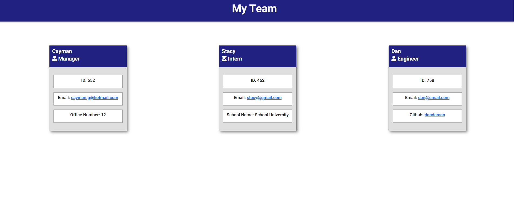

# Team page generator

## Description

This application allows a user to enter in the manager and employee's information to generate a web page.

## Install

To use this application you will need to clone the repository or download files. Once you have the files
bring up your prefered terminal (NOTE: this application utilizies NODE.js and must be installed) and then 
travel to the file folder you have stored the application. When your there run ``node install`` in the 
terminal to download dependencies 

## Languages

* Javascript (ES6)
* HTML
* CSS
* NODE.js
* Jest

## 

## Tutorial

https://user-images.githubusercontent.com/32405255/130883417-f8e5cc2a-f509-4f48-b30e-257e089c9cc1.mp4
